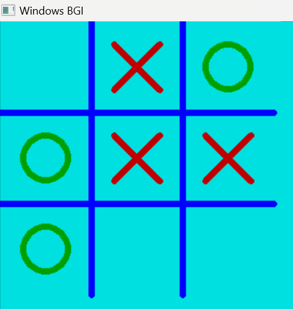

# 🎮 Creative Tic-Tac-Toe – Play, Click, Win!

## 🏆 About the Game
Step into the ultimate Tic-Tac-Toe showdown! This game is built using **C++ and graphics.h**, with visually engaging interface and smooth mouse controls. Whether you're an **X champ** or an **O strategist**, get ready to **click, play, and conquer!**

## 🚀 How It Works
1. The **gameboard appears**, ready for action.
2. Players take turns **clicking on the grid** to place X or O.
3. The game **automatically checks for a winner**.
4. If a player wins, a bold **"Winner!"** message appears! 
5. The board **resets**, and the battle continues!

## 🛠 Awesome Features
-  **Interactive mouse-based gameplay** – Just click and play!
-  **Smooth graphics** – Powered by `graphics.h`
-  **Auto win detection** – No need to count, the game does it for you!
-  **Instant board reset** – Keep playing non-stop!
-  ---
## Tic-Tac-Toe Visualization:

Here is a visual representation of how Tic-Tac-Toe game play:

---

## 🔧 Tools & Technologies Used
-  **C++** – Core logic and game mechanics
-  **graphics.h** – For stunning visual elements
-  **Mouse input handling** – Click anywhere to make your move
-  **Dev-C++** – Compile and run your game smoothly

## 🎯 How to Play
- **Click** on a cell to place X or O  
- Get **three in a row** (horizontal, vertical, or diagonal)  
- Celebrate your **win** or try again when the board resets!  

  

